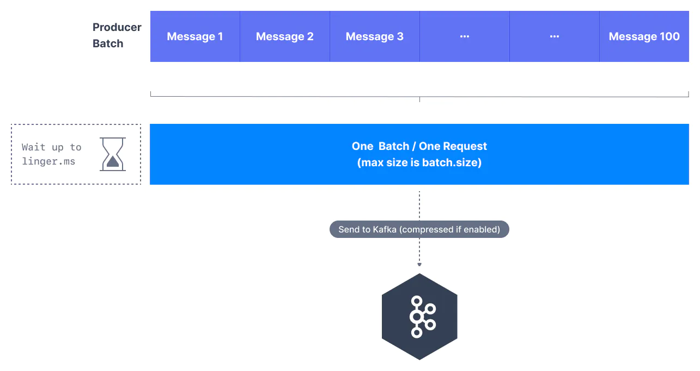
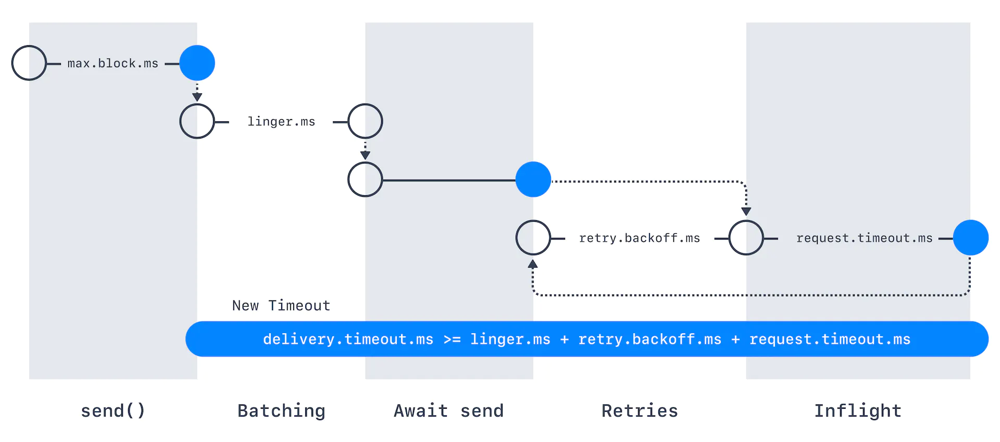

# kafka-resilience
`Examples of Kafka Producers and Consumers`

# Producer Configs

Por padrão, os produtores do Kafka tentam enviar os discos o mais rápido possível. Um produtor terá até 5 solicitações em andamento (controladas pelo ``max.in.flight.requests.per.connection`` setting), o que significa que até 5 lotes de mensagens serão enviados ao mesmo tempo. Depois disso, se mais mensagens precisarem ser enviadas enquanto outras estiverem em andamento, os produtores Kafka serão espertos e começarão a agrupar mensagens enquanto as solicitações de mensagens anteriores terminam.

Esse lote inteligente permite que o Kafka aumente o rendimento enquanto mantém uma latência muito baixa. Os lotes têm uma taxa de compactação mais alta, proporcionando melhor eficiência de disco e rede. O lote é controlado principalmente por duas configurações de produtor - ``linger.ms`` and ``batch.size``.

**`linger.ms`**: is the number of milliseconds a producer is willing to wait before sending a batch out. The default value is 0, which means "send the messages right away"

**`batch.size`**: é o número máximo de bytes que serão incluídos em um lote.
O padrão é 16KB. Aumentar o tamanho do lote para 32KBou 64KBpode ajudar a aumentar a compactação, o rendimento e a eficiência das solicitações. Qualquer mensagem maior que o tamanho do lote não será agrupada. Um lote é alocado por partição, portanto, certifique-se de não configurá-lo para um número muito alto, caso contrário, você poderá usar muito memória!

>###**Principais conclusões**
>* Aumente `linger.ms` e o produtor esperará alguns milissegundos para que os lotes sejam preenchidos antes de enviá-los.
>* Se você estiver enviando lotes completos e tiver memória sobrando, poderá aumentar `batch.size` e enviar lotes maiores.

**`retries`**: configuração determina quantas vezes o produtor tentará enviar uma mensagem antes de marcá-la como falhada.

`delivery.timeout.ms`: Se retries > 0, por exemplo, retries = 2147483647o produtor não tentar a solicitação para sempre, ela será limitada por um tempo limite. Para isso, você pode definir um Tempo Limite do Produtor intuitivo ( KIP-91 – Kafka 2.1 ) como delivery.timeout.ms=120000(= 2 minutos). Os registros falharão se não puderem ser entregues emdelivery.timeout.ms 

`backoff`: Por padrão, o produtor aguardará 100msentre as tentativas, mas você pode controlar isso usando o retry.backoff.msparâmetro.

`max.in`: Permitir novas tentativas sem definir max.in.flight.requests.per.connectioncomo 1 alterará potencialmente a ordem dos registros porque se dois lotes forem enviados para uma única partição e o primeiro falhar e for repetido, mas o segundo for bem-sucedido, os registros do segundo lote poderão aparecer primeiro. Se você depende de pedidos baseados em chave, isso pode ser um problema. Ao limitar o número de solicitações em andamento para 1(o padrão é 5), ou seja, max.in.flight.requests.per.connection = 1,podemos garantir que o Kafka preservará a ordem das mensagens no caso de algumas mensagens exigirem várias tentativas antes de serem reconhecidas com sucesso.

>###**Segurança versus rendimento**
>A configuração max.in.flight.requests.per.connection=1pode diminuir significativamente seu rendimento

MUITO importante: se habilitarmos idempotence enable=idempotence=true, então é necessário que max.in.flight.requests.per.connectionseja menor ou igual a 5 com a ordem das mensagens preservada para qualquer valor permitido!!